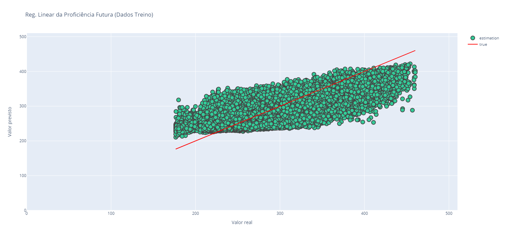
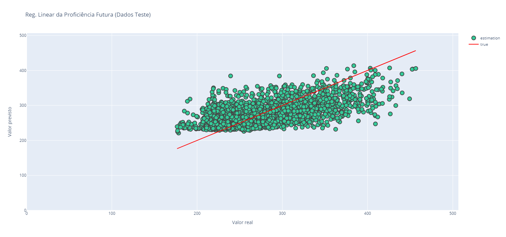
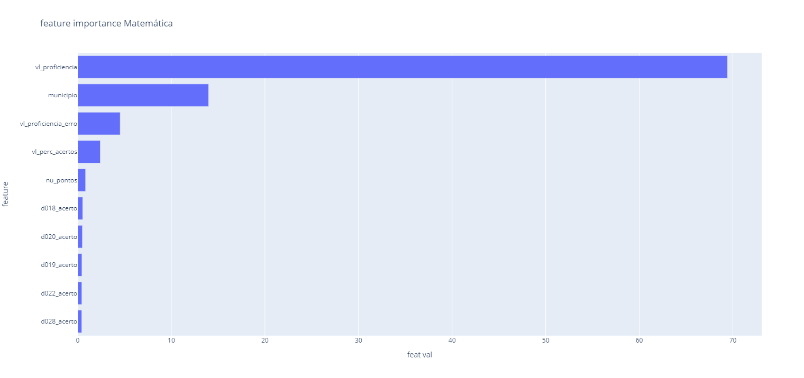
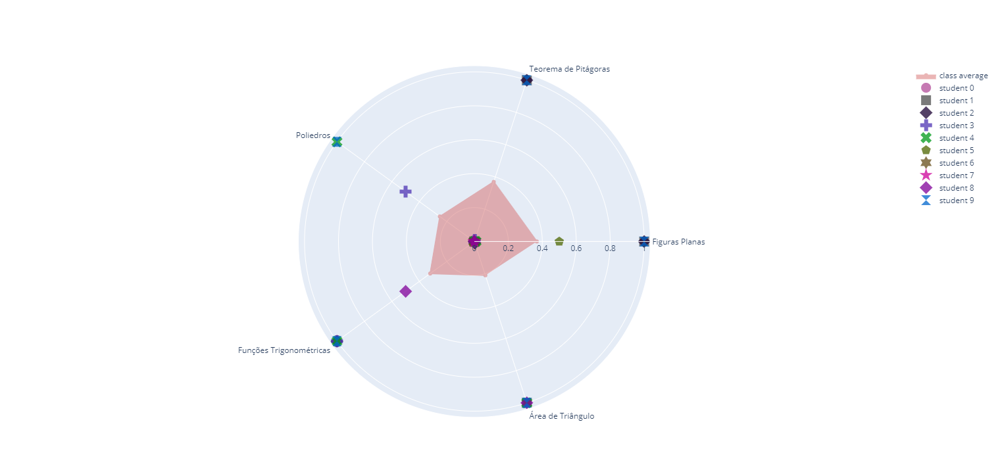
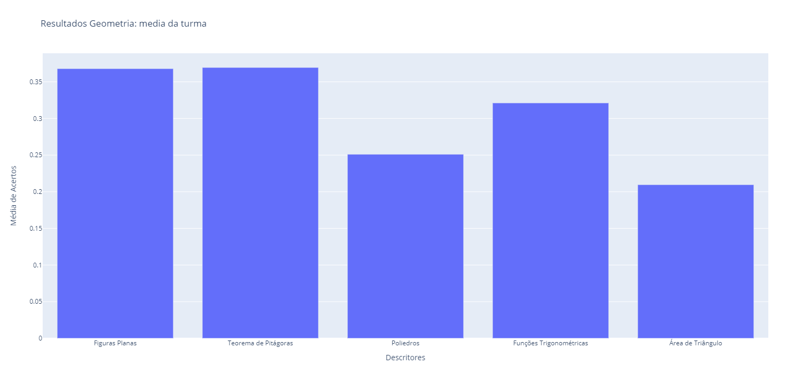
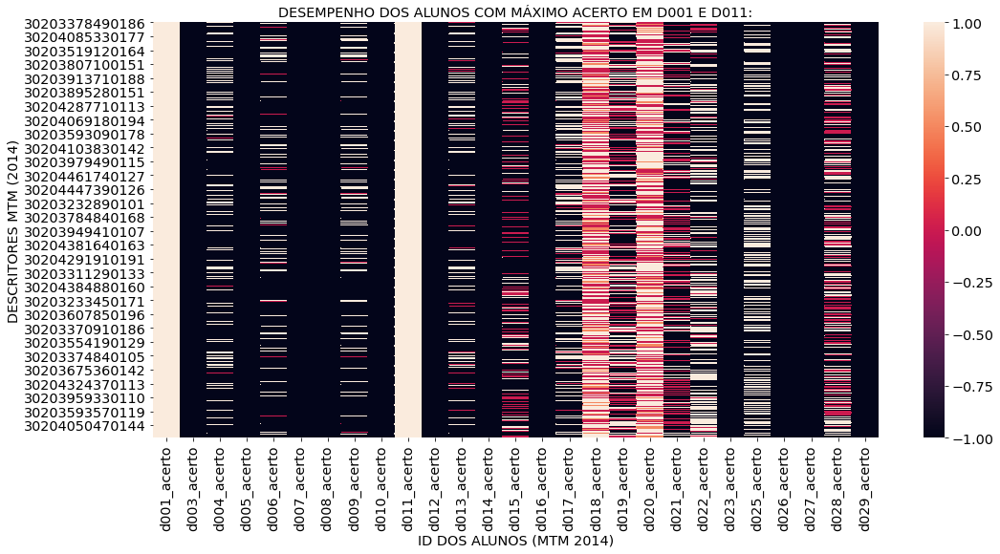
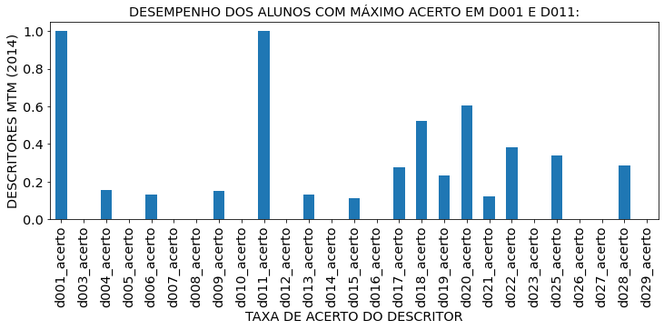

# BatalhaDeDados-J: ANA

## Modelagem e Tratamento de Dados

:blue_book: [Caderno Jupyter com o desenvolvimento da modelagem e tratamento dos dados](modelagem_datavis.ipynb)

Todo processamento foi realizado em Python, usando cadernos Jupyter dentro do ambiente Sagemaker na plataforma da Amazon.
Os dados estavam hospedados em um bucket no S3 da AWS.
Portanto não é possível reproduzir o caderno sem criar a mesma configuração ou sem acesso às fontes originais.

Apesar disso, todas as saídas das células estão visíveis no caderno deste repositório.  
Para facilitar, as imagens geradas estão na pasta [graficos_pylot](./graficos_pylot/).

### Modelo de previsão de proficiência futura

Realizamos uma modelagem de entrada/saída para previsão de proficiência.  

Esse preprocessamento foi feito apenas para a base SPAECE 2014.  
Isso porque ela servirá como informação de entrada para prever a proficiência dos mesmos alunos no final do ensino médio.  
Os rótulos das saídas verdadeiras são os dados de proficiência da base SPAEC 2015.

As variáveis categóricas utilizadas foram código do município, código do turno da turma e flag de turma multiseriada.  
As variáveis contínuas utilizadas foram a proficiência atual, valor de pontuação no teste, taxa de acerto do teste e confiança da proficiência atual.

O modelo escolhido foi um Regressor Random Forest, pois além de apresentar melhor resultado que uma regressão linear e outros hiperparâmetros ajustáveis, também fornece uma relação clara de importância de features.

### Gráficos de Desempenho da Turma

Utilizando gráficos polares, mostramos o desempenho médio da turma em relação aos descritores de habilidades das avaliações.  
Os gráficos também permitem comparar alunos selecionados com a média da turma.

### Correlação de acertos entre descritores

Alguns mapas de calor e gráficos de barra também permitem mostrar quais os descritores mais (ou menos) acertados por alunos que possuem um bom (ou mal) desempenho em descritores pré-definidos pelo analista.

## Sistemas concorrentes 
Do ponto de vista de tratamento e análise de dados educacionais, duas soluções existentes inspiraram nossas propostas:
- a plataforma [SISEDU (Sistema Online de Avaliação, Suporte e Acompanhamento Educacional)](https://sisedu.ced.ce.gov.br/), desenvolvida especificamente para o cenário das escolas estaduais do Ceará
- o trabalho acadêmico ["Junhua Liu et al. Self-Evolving Adaptive Learning for Personalized Education. CSCW '20 Companion. Oct 2020"](https://dl.acm.org/doi/pdf/10.1145/3406865.3418326), uma aplicação estrangeira, denominada SEAL, a qual também busca oferece um sistema de personalização das trajetórias de aprendizagem e de monitoramento inteligente de dados de desempenho dos alunos para professores escolas.

A imagem abaixo mostra um resumo dos nossos estudos preliminares das principais características do SISEDU.
Após conversar com professores e profissionais da rede de educação do Ceará, constatamos que os principais problemas do SISEDU são:
- não ter uma filosofia muito colaborativa para o desenvolvimento de bancos de questões
- não entregar diretamente para o professor os microdados e resultados agregados das estatísticas de desempenho das suas turmas, com os principais resultados de saberes que geraram maiores erros ou dificuldades (aparentemente isso só acontece quando alguém da Secretaria compila os dados e leva a informação para as escolas)
- não ofercer claramente para o professor uma ação sugerida sobre qual estratégia pedagótica ele deve adotar imediatamente após o professor aplicar suas aulas/atividades e coletar os dados de avaliação dos alunos da sua turma.

Já na imagem abaixo, mapeamos as principais características descritas no trabalho estrangeiro do sistema SEAL.
Algumas das soluções propostas no SEAL estão bastante alinhadas com a nossa visão das necessidades e potenciais do sistema ANA.
Entretanto, desconhecemos os detalhes de implementação e difusão do sistema mostrado neste trabalho, ressaltando que é uma publicação bastante recente (divulgada já dentro do período de pandemia).

 
